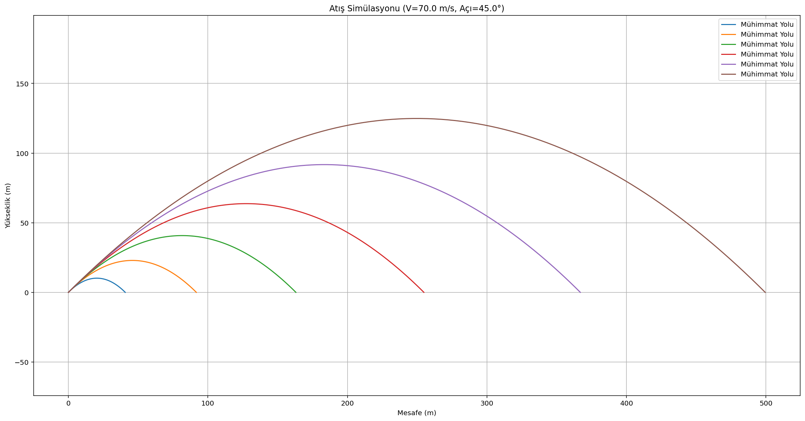

# 🚀 Ballistic Motion Simulator (Balistik Hareket Simülatörü)


Bu proje, temel kinematik prensiplerini kullanarak 2D uzayda eğik atış (projectile motion) hareketini simüle eden ve görselleştiren bir Python uygulamasıdır. **NumPy**'ın vektörel işlem gücü ve **Matplotlib**'in görselleştirme yetenekleri kullanılarak, mühimmatın yörüngesi, uçuş süresi ve menzili yüksek hassasiyetle hesaplanır.

Savunma sanayi algoritmaları ve fizik simülasyonları üzerine geliştirilecek daha kapsamlı bir ekosistemin (Roadmap) ilk adımıdır.

---

## 📸 Örnek Çıktı



> **Not:** Grafikler `Equal Aspect Ratio` (Eşit Ölçekleme) ile çizildiği için mühimmatın gerçek fiziksel yörüngesini birebir yansıtır.

---

## 🛠️ Özellikler

* **Vektörel Hesaplama:** `for` döngüleri yerine NumPy dizileri (arrays) kullanılarak yüksek performanslı hesaplama (C seviyesinde hız).
* **Dinamik Girdi:** Kullanıcıdan alınan `Hız (m/s)` ve `Açı (Derece)` değerlerine göre anlık simülasyon.
* **Modüler Yapı:** Çıkış süresi, iniş süresi ve anlık konumlar ayrı fonksiyonlar halinde matematiksel olarak modellenmiştir.
* **Temel Kinematik:** Hava sürtünmesi ihmal edilerek ideal ortamdaki hareket analizi.

---

## 📐 Matematiksel Model

Simülasyon aşağıdaki hareket denklemleri üzerine kuruludur:

**Yatay Konum ($x$):**
$$x(t) = v_0 \cdot \cos(\theta) \cdot t$$

**Dikey Konum ($y$):**
$$y(t) = y_0 + v_0 \cdot \sin(\theta) \cdot t - \frac{1}{2} g t^2$$

Burada:
* $v_0$: İlk Hız
* $\theta$: Atış Açısı (Radyan)
* $g$: Yerçekimi İvmesi ($9.81 m/s^2$)

---

## ⚙️ Kurulum ve Kullanım

Projeyi kendi bilgisayarınızda çalıştırmak için:

1.  **Repoyu Klonlayın:**
    ```bash
    git clone [https://github.com/KULLANICI_ADINIZ/ballistic-simulator.git](https://github.com/KULLANICI_ADINIZ/ballistic-simulator.git)
    cd ballistic-simulator
    ```

2.  **Gerekli Kütüphaneleri Yükleyin:**
    ```bash
    pip install numpy matplotlib
    ```

3.  **Simülasyonu Başlatın:**
    ```bash
    python main.py
    ```

4.  **Veri Girişi:** Konsol ekranında istenilen `İlk Hız` ve `Açı` değerlerini girin. Grafik otomatik olarak açılacaktır.

---

## 🗺️ Roadmap (Geliştirme Planı)

Bu proje yaşayan bir simülasyon kütüphanesi olmayı hedeflemektedir. Gelecek sürümler için planlanan özellikler:

### Faz 1: Fizik Motoru (Tamamlandı ✅)
- [x] Temel eğik atış simülasyonu.
- [x] NumPy ile vektörizasyon optimizasyonu.
- [x] Matplotlib ile görselleştirme.

### Faz 2: İleri Analiz (Geliştirme Aşamasında 🚧)
- [ ] **Hava Sürtünmesi (Drag Force):** Havanın yoğunluğu ve cismin şekline göre sürtünme katsayısının eklenmesi.
- [ ] **Rüzgar Etkisi:** Rüzgarın mühimmatı saptırma analizi.
- [ ] **Karşılaştırmalı Analiz:** Farklı açıların ve hızların aynı grafik üzerinde kıyaslanması (Envelope Graph).

### Faz 3: Kullanıcı Arayüzü (GUI)
- [ ] **Arayüz Tasarımı:** PyQt5 veya Tkinter ile modern bir kontrol paneli.
- [ ] **Slider Kontrolü:** Açı ve hızın kaydırıcılarla anlık değiştirilmesi.
- [ ] **Raporlama:** Sonuçların Excel/PDF olarak dışa aktarılması.

---

## 📂 Dosya Yapısı

```text
ballistic-simulator/
├── main.py          # Ana simülasyon kodu ve algoritmalar
├── README.md        # Proje dokümantasyonu
├── requirements.txt # Gerekli kütüphaneler listesi
└── assets/          # Ekran görüntüleri ve görseller
